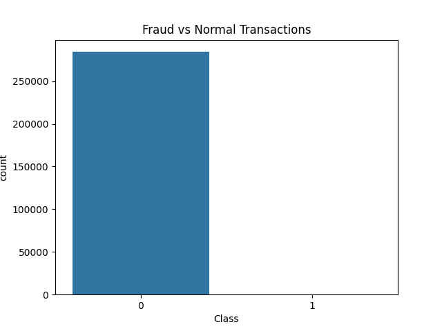
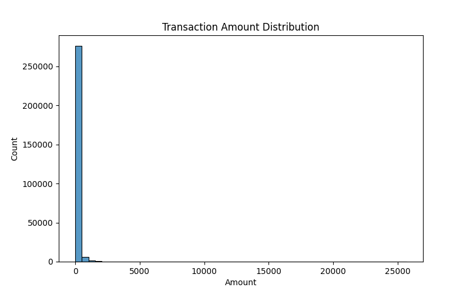
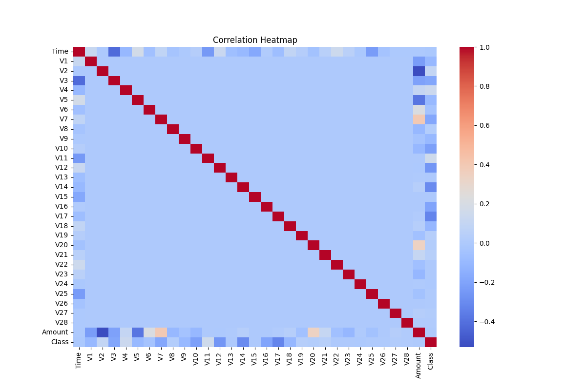

# 💳 Credit Card Fraud Detection System

## 📌 Project Overview
This project aims to detect fraudulent credit card transactions using Machine Learning techniques.

The system analyzes transaction data and predicts whether a transaction is fraudulent or normal.

---

## 🎯 Objectives
- Perform Exploratory Data Analysis (EDA)
- Analyze fraud transaction patterns
- Build a Machine Learning prediction model
- Create an interactive Streamlit application

---

## 📊 Dataset
- Source: Kaggle Credit Card Fraud Detection Dataset
- Features:
  - Time
  - Amount
  - V1 to V28 anonymized features

**Target Variable**
- Class
  - 0 → Normal Transaction
  - 1 → Fraudulent Transaction

---

## 🔍 Exploratory Data Analysis

Performed visual analysis using:
- Fraud vs Normal Transaction Count
- Transaction Amount Distribution
- Correlation Heatmap

---

## 📸 Visualizations

### Fraud Count


### Amount Distribution


### Correlation Heatmap


---

## ⚙️ Technologies Used

- Python
- Pandas
- NumPy
- Matplotlib
- Seaborn
- Scikit-learn
- Streamlit

---

## 🤖 Machine Learning Model

- Model Used:
  - Random Forest Classifier

### Features Used
- Time
- Amount

### Steps
- Data preprocessing
- Train-test split
- Model training
- Prediction
- Evaluation

---

## 📈 Model Evaluation

Evaluated using:
- Accuracy Score
- Classification Report
- Confusion Matrix

---

## 💻 Streamlit Application

An interactive web application was developed using Streamlit.

### Features
- User input interface
- Fraud prediction
- Real-time output

---

## ▶️ How to Run

### Install Dependencies
```bash
pip install -r requirements.txt
```

### Run Streamlit App
```bash
cd dashboard
python -m streamlit run app.py
```

---

## 📁 Project Structure

```text
Credit-Card-Fraud-Detection/
│
├── dataset/
├── notebook/
├── images/
├── src/
├── dashboard/
├── README.md
└── requirements.txt
```

---

## 🚀 Future Improvements
- Use advanced fraud detection algorithms
- Improve prediction accuracy
- Deploy application online
- Add real-time transaction monitoring

---

## 📌 Conclusion
This project demonstrates how Machine Learning can be used to identify fraudulent financial transactions and improve security systems.